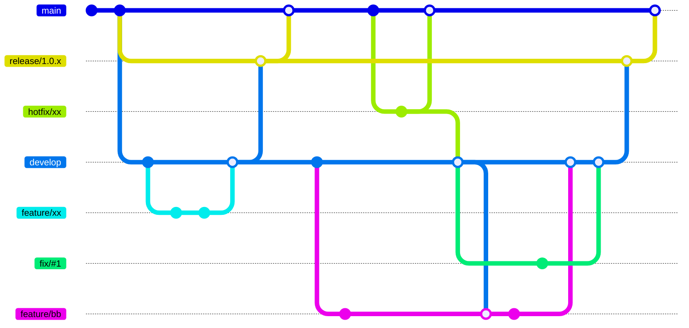

# 🐈 NEKO BOT 🐾

## Git flow


## Clone
> git clone --recurse-submodules https://github.com/naoido/neko-bot.git

## .env
```env
DISCORD_TOKEN=YOUR_DISCORD_TOKEN
DISCORD_STATUS_TYPE=online
DISCORD_ACTIVITY_MESSAGE="Just chilling..."
```